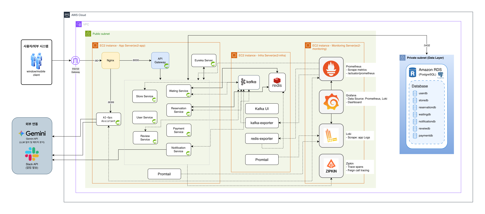
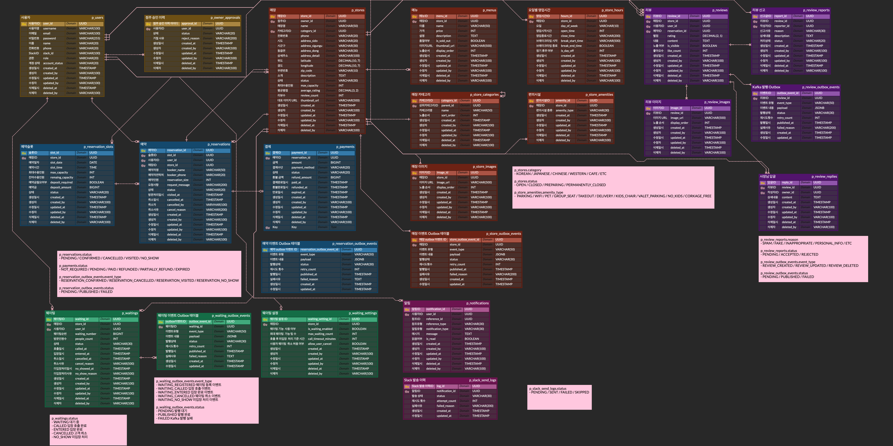

# KOK


MSA 기반 실시간 레스토랑 예약·웨이팅 플랫폼 KOK 백엔드 서비스

이 README는 프로젝트 진입점입니다. 각 서비스의 상세 기능은 [docs/services](docs/services)의 서비스별 문서를 참고하세요.

## Architecture

```text
Client
  │
  ▼
api-gateway (8000)  ──▶  eureka-server (8761)
  │
  ├── user-service          (8001)
  ├── store-service         (8002)
  ├── reservation-service   (8003)
  ├── waiting-service       (8004)
  ├── notification-service  (8005)
  ├── review-service        (8006)
  └── payment-service       (8007)

services ──sync──▶ Feign
services ──async─▶ Kafka (Outbox 패턴) ──▶ services
```

서비스 간 통신은 동기 호출(Feign + Resilience4j CircuitBreaker)과 비동기 이벤트(Kafka, Transactional Outbox 패턴)를 함께 사용합니다. 이벤트 흐름 상세는 [docs/kafka-event-flow.md](docs/kafka-event-flow.md) 참고.

### 인프라 설계서



### ERD



## Tech Stack

- **Language/Framework**: Java 17, Spring Boot, Spring Cloud Gateway, Eureka, OpenFeign
- **Data**: PostgreSQL, Redis
- **Messaging**: Kafka
- **Observability**: Prometheus, Grafana, Loki, Promtail, Zipkin
- **Infra**: Docker, Terraform, GitHub Actions
- **Load Test**: k6, JMeter

## Services

| Service | Port | Description | Docs |
|---|---|---|---|
| user-service | 8001 | 회원가입/인증(JWT), 권한 관리, 사장님 승인 워크플로 | [docs/services/user-service.md](docs/services/user-service.md) |
| store-service | 8002 | 매장/메뉴 관리, 검색·랭킹, 캐싱 | [docs/services/store-service.md](docs/services/store-service.md) |
| reservation-service | 8003 | 예약/슬롯 관리, 오버부킹 방지, 결제 연동 | [docs/services/reservation-service.md](docs/services/reservation-service.md) |
| waiting-service | 8004 | 웨이팅 등록/순번 관리, 실시간 큐 처리 | [docs/services/waiting-service.md](docs/services/waiting-service.md) |
| notification-service | 8005 | 이벤트 기반 알림, Slack 발송 | [docs/services/notification-service.md](docs/services/notification-service.md) |
| review-service | 8006 | 리뷰 작성/신고/답글, 평점 집계 | [docs/services/review-service.md](docs/services/review-service.md) |
| payment-service | 8007 | 결제 생성/환불/만료 (내부 API) | [docs/services/payment-service.md](docs/services/payment-service.md) |

인프라 컴포넌트: `infrastructure/eureka-server` (8761), `infrastructure/api-gateway` (8000), `infrastructure/ai-ops-assistant` (8099)

## Getting Started

### Prerequisites
- JDK 17
- Docker / Docker Compose

### 인프라 실행
```bash
docker-compose up -d
```
Eureka, PostgreSQL, Redis, Kafka, Prometheus, Zipkin, Loki, Grafana가 기동됩니다. 필요한 환경변수는 `.env`를 참고하세요.

### 서비스 실행
```bash
./gradlew :services:user-service:bootRun
./gradlew :services:store-service:bootRun
# ... 나머지 서비스 동일
```

## API Documentation

- Swagger 문서: [api-docs](api-docs) (서비스별 HTML/JSON)

## Observability

- Grafana: `http://localhost:${GRAFANA_PORT:-3000}` (기본 계정 admin/admin)
- Prometheus: `http://localhost:${PROMETHEUS_PORT:-9090}`
- Zipkin: `http://localhost:${ZIPKIN_PORT:-9411}`
