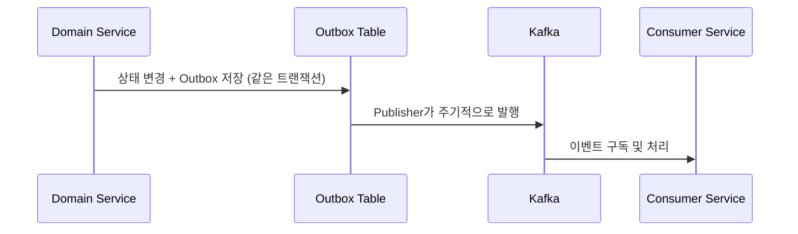
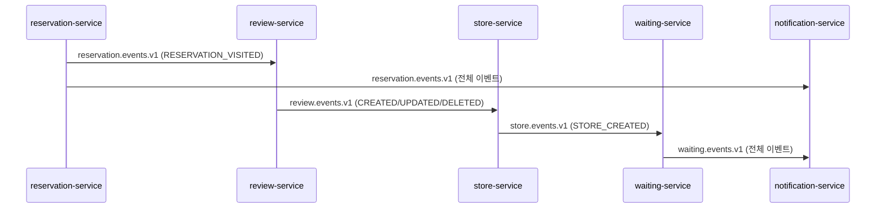
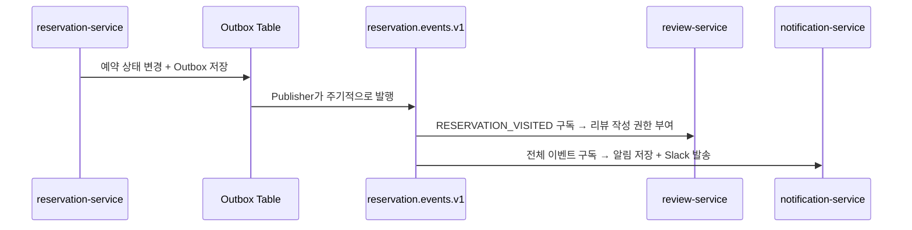
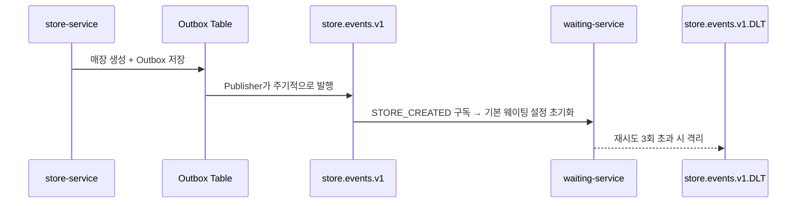
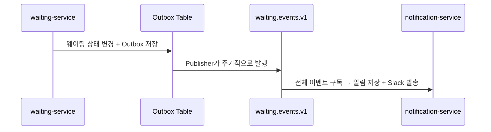
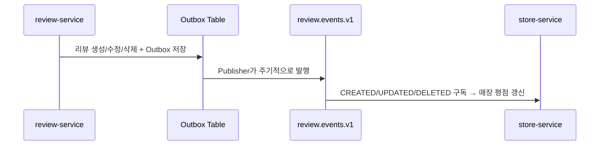

# Kafka 이벤트 흐름

## 공통 패턴: Transactional Outbox

모든 서비스가 이벤트를 발행할 때 공통으로 사용하는 패턴입니다. 도메인 상태 변경과 Outbox 저장을 같은 트랜잭션으로 묶어 원자성을 보장하고, 별도 스케줄러가 Outbox 테이블을 폴링해서 Kafka로 발행합니다.

## 전체 개요

## 토픽별 상세 흐름

### reservation.events.v1

### store.events.v1

### waiting.events.v1

### review.events.v1

## Kafka Topic / Producer / Consumer

| Topic | Producer | Consumer | 주요 이벤트 타입 | 용도 |
|---|---|---|---|---|
| `reservation.events.v1` | reservation-service | review-service | `RESERVATION_VISITED` | 방문 완료 시 리뷰 작성 권한 부여 |
| `reservation.events.v1` | reservation-service | notification-service | 전체 (`CONFIRMED`, `CANCELLED`, `VISITED`, `NO_SHOW`, `CHANGED`, `REMINDER_1DAY/1HOUR`) | 알림 저장 + Slack 발송 |
| `store.events.v1` | store-service | waiting-service | `STORE_CREATED` | 매장 생성 시 기본 웨이팅 설정 초기화 |
| `waiting.events.v1` | waiting-service | notification-service | 전체 (`REGISTERED`, `CALLED`, `ENTERED`, `CANCELLED`, `NO_SHOW`) | 알림 저장 + Slack 발송 |
| `review.events.v1` | review-service | store-service | `REVIEW_CREATED/UPDATED/DELETED` | 매장 평균 평점·리뷰 수 갱신 |
| `store.events.v1.DLT` | waiting-service (내부 격리용) | - | 재시도 3회 초과 실패 메시지 | Dead Letter Topic |

> 참고: 모든 Producer는 Transactional Outbox 패턴(DB 저장 → 스케줄러 폴링 → 발행)을 사용합니다. `review.events.v1`의 `REVIEW_REPORT_RESULT`/`REVIEW_REPLY` 이벤트는 아직 구독하는 Consumer가 없어 표에서 제외했습니다.
